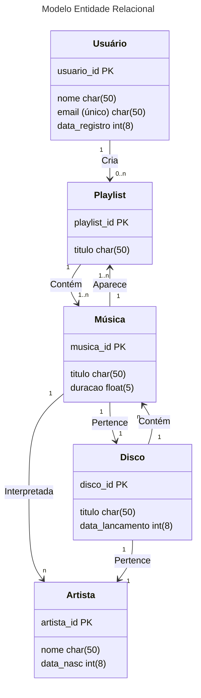

# Modelo Entidade-Relacional

## Entidades

- **ARTISTA**
  - `artista_id` (PK)
  - `nome`
  - `data_nascimento`

- **DISCO**
  - `disco_id` (PK)
  - `titulo`
  - `data_lancamento`
  

- **MUSICA**
  - `musica_id` (PK)
  - `titulo`
  - `duracao`
  

- **USUARIO**
  - `usuario_id` (PK)
  - `nome`
  - `email` (único)
  - `data_registro`

- **PLAYLIST**
  - `playlist_id` (PK)
  - `titulo`
 
## Diagrama MER

