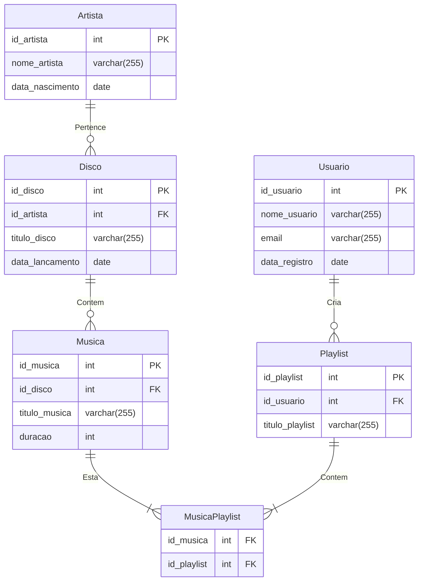

```mermaid
erDiagram
    
    Artista {
        id_artista int PK
        nome_artista varchar(255)
        data_nascimento date
    }

    Disco {
        id_disco int PK
        id_artista int FK
        titulo_disco varchar(255)
        data_lancamento date
    }

    Musica {
        id_musica int PK
        id_disco int FK
        titulo_musica varchar(255)
        duracao int
    }


     Playlist {
        id_playlist int PK
        id_usuario int FK
        titulo_playlist varchar(255)
    }

    MusicaPlaylist {
        id_musica int FK
        id_playlist int FK
    }

     Usuario {
        id_usuario int PK
        nome_usuario varchar(255)
        email varchar(255) 
        data_registro date
    }
  
    
    Artista ||--o{ Disco : Pertence 
    Disco ||--o{ Musica : Contem
    Usuario ||--o{ Playlist : Cria
    Musica ||--|{ MusicaPlaylist : Esta
    Playlist ||--|{ MusicaPlaylist : Contem
```
