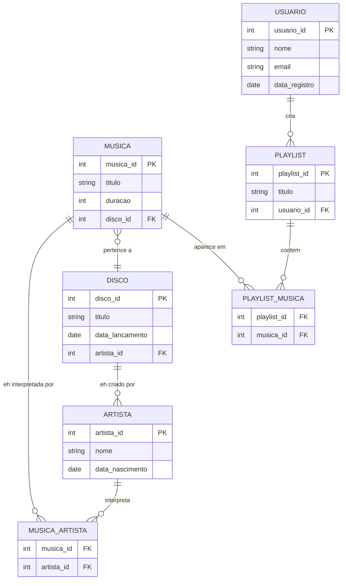

# MR -  Modelo relacional 💱

### Abaixo a representação dos diagramas MR 👇

```mermaid
erDiagram
    MUSICA {
        int musica_id PK
        string titulo
        int duracao
        int disco_id FK
    }

    ARTISTA {
        int artista_id PK
        string nome
        date data_nascimento
    }

    DISCO {
        int disco_id PK
        string titulo
        date data_lancamento
        int artista_id FK
    }

    USUARIO {
        int usuario_id PK
        string nome
        string email
        date data_registro
    }

    PLAYLIST {
        int playlist_id PK
        string titulo
        int usuario_id FK
    }

    MUSICA_ARTISTA {
        int musica_id FK
        int artista_id FK
    }

    PLAYLIST_MUSICA {
        int playlist_id FK
        int musica_id FK
    }

    MUSICA ||--o{ MUSICA_ARTISTA : "eh interpretada por"
    ARTISTA ||--o{ MUSICA_ARTISTA : "interpreta"
    MUSICA }o--|| DISCO : "pertence a"
    DISCO ||--o{ ARTISTA : "eh criado por"
    USUARIO ||--o{ PLAYLIST : "cria"
    PLAYLIST ||--o{ PLAYLIST_MUSICA : "contem"
    MUSICA ||--o{ PLAYLIST_MUSICA : "aparece em"


```
