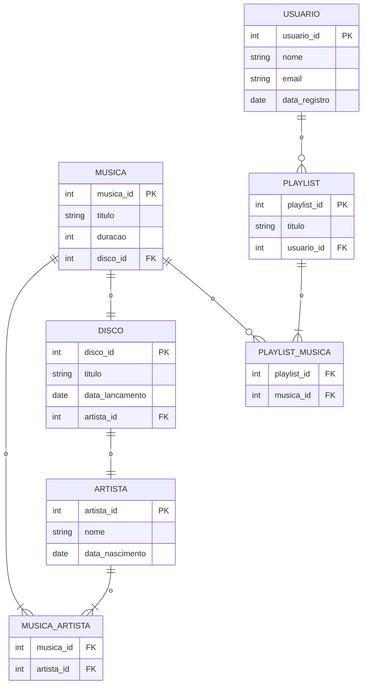

# MR -  Modelo relacional 💱

### Abaixo a representação dos diagramas MR 👇

```mermaid
erDiagram
    MUSICA {
        int musica_id PK
        string titulo
        int duracao
        int disco_id FK
    }

    ARTISTA {
        int artista_id PK
        string nome
        date data_nascimento
    }

    DISCO {
        int disco_id PK
        string titulo
        date data_lancamento
        int artista_id FK
    }

    USUARIO {
        int usuario_id PK
        string nome
        string email
        date data_registro
    }

    PLAYLIST {
        int playlist_id PK
        string titulo
        int usuario_id FK
    }

    MUSICA_ARTISTA {
        int musica_id FK
        int artista_id FK
    }

    PLAYLIST_MUSICA {
        int playlist_id FK
        int musica_id FK
    }

    MUSICA ||--|{ MUSICA_ARTISTA: o
    ARTISTA ||--|{ MUSICA_ARTISTA : o
    MUSICA ||--|| DISCO : o
    DISCO ||--|| ARTISTA : o
    USUARIO ||--o{ PLAYLIST : o
    PLAYLIST ||--|{ PLAYLIST_MUSICA : o 
    MUSICA ||--o{ PLAYLIST_MUSICA : o


```
